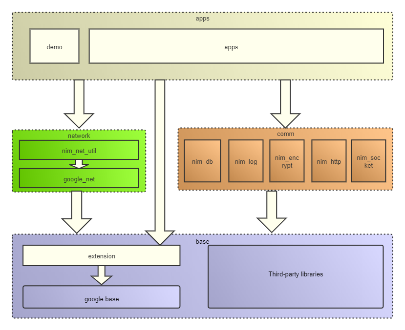

# phoenix

网易云信跨平台C++开发框架是从云信跨平台SDK所使用到的开发框架中抽象而来，提供了包括通信套接字、本地缓存、加/解密、线程模型、日志等基础功能组件的能力以及对常用的三方库的二次封装后提供的能力，是长期支撑云信跨平台业务的根基。通过学习和应用这个框架，你可以快速搭建跨平台的应用能力。

## 基础架构设计



- base
  - google_base: google chromium base
  - extension: 对google chromium base的再次封装及功能补充
  - third_party: 使用到的三方库
 - network
   - nim_net_util: 网络工具库
   - google_net: google chromium net(部分)
- comm
   - nim_db: 本地缓存组件
   - nim_log: 日志组件
   - nim_http: http组件
   - nim_encrypt: 加/解密组件
   - nim_socket: socket组件

## 开始

克隆项目到你的磁盘中

```bash
git clone https://github.com/netease-im/phoenix
```

进入 `project` 目录，可以找到对应平台的工程文件

## 目录

├─ `docs` phoenix开发框架的使用文档  
├─ `phoenix` 源代码目录  
├─── `base` 基础类库  
├───── `google_base` google chromium base   
├───── `extension` 对google chromium base的再次封装及功能补充   
├─── `build` 编译时依赖文件  
├─── `comm` 基础组件  
├───── `nim_db` 本地缓存组件  
├───── `nim_encrypt` 加/解密组件  
├───── `nim_http` http组件  
├───── `nim_log` 日志组件  
├─── `network` 网络库  
├───── `google_net` google chromium net(部分)  
├───── `proxy_config` 基础类库  
├─ `phoenix_framework` 编译输出目录  
├─ `project` 各平台的工程文件  
├─ `simples` 简单的示例程序  
├─ `third_party` 使用到的三方类库  

## 入门

 - [接入windows](docs/getting-started/windows.md)

 ## 快速上手

 - [简单入门](docs/getting-started/comm/init.md)

 - [nim_log 使用](docs/getting-started/comm/log.md)

 - [nim_http 使用](docs/getting-started/comm/http.md)

 - [nim_encrypt 使用](docs/getting-started/comm/encrypt.md)

 - [nim_net_util 使用](docs/getting-started/comm/net-util.md)

 - [nim_db 使用](docs/getting-started/comm/db.md)

 ## TODO
 - Windows 平台动态库适配
 - Mac 平台适配
 - Linux 平台适配
 - third_party 以代码形式引入

## 交流

 - 遇到问题：参考[示例程序](simples/README.md)来帮助你解决疑惑
 - 提交缺陷：在确保使用最新版本依然存在问题时请尽量以简洁的语言描述清楚复现该问题的步骤并提交 issue
 - 功能建议：如果你有什么好的想法或者提案，欢迎提交 issue 与我们交流
